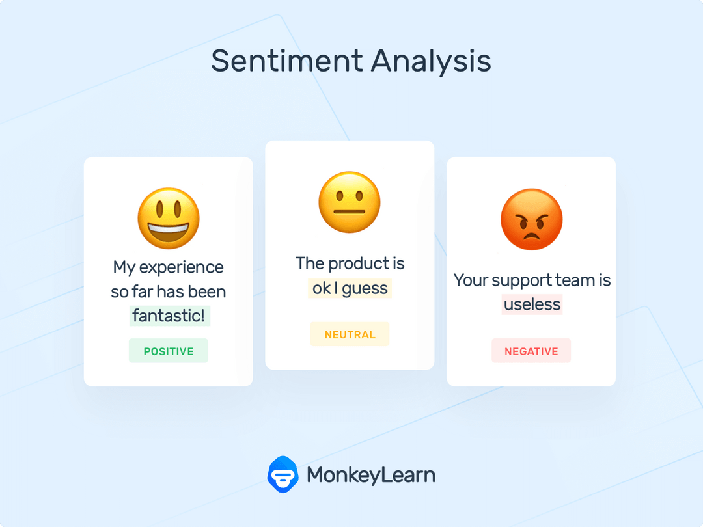

## SENTIMENT ANALYSIS OF CUSTOMER'S REVIEWS ON TOP FINTECH COMPANIES PRODUCTS 

## INTRODUCTION

In everyday life, companies(technical and non-technical) and start-ups release products of different categories for consumer's benefits. Selection of one or more of these products are accompanied by the experience and feedbacks of the earlier users. Early adopters justify their experience with reviews and tweets on the social media, and also ratings. Ratings can be easily sorted and judged as its scaled. But reviews and tweets are texts, positive or negative, which will requires thorough reading for the message to be conveyed to the developer of the products.

 With the advent of a branch of Artificiial Intelligence, Natural Language Processing (NLP), its tools, algorithms and its implemention has helped companies to lessen and ease the task of analyzing the corpus to make better decisions, corrections and improved their products and servivces.

## UNDERSTANDNG THE PROBLEM STATEMENT
<li>The first step in any machine learning task is understanding the problem statement, So that's what we aim to do here. </li>
<li> FinTech (financial Technology) is catch-all term referring to software, mobile applications and other technologies created to provide and improve financial solutions to businesses and consumers, automate traditional forms of finance and guide its users to making better decisions in their finances. </li>
<li>FinTech has had enormous impact over the years with firms doing a great job to provide big improvement in services rendered to customer. </li>
<li>I am a big fan of FinTech, and I have seen complaints and feedbacks on social media and also reviews from Google App Playstore which depicts the experience from users of these tech services </li>.
<li>These feedbacks and revews are essential to detect and understand customer feelings, generate insights into how companies make decision to enhance customer experience and improve their services. </li>

## SENTIMENT ANALYSIS

 Sentiment analysis (or opinion mining) is a Natural Language Processing (NLP) technique used to determine whether a text is positive, negative or neutral. Sentiment analysis is a textual classification tool that help businesses monitor brand and product sentiment in customer feedback, and understand customer feelings, thoughts more openly than before. With this technology, companies can analyze feedbacks from responses, sentiments, surveys, tweets and easily attend to their customer to better tailor their products and services to meet their needs. 

## DATASETS

 The datasets used for this project is derived from reviews scraped from the Google App Playstore of the <b> Top 8 FinTech Companies in Africa -Flutter wave,  Opay, Palm Pay, Chipper Cash, Interswitch, PiggyVest, Paga and Kuda bank. </b>.
Since the reviews on the internet are imbalanced, the reviews data are scraped with rating 3 -Neutral make up twice as much as the other ratings. Also, to get the important ratings and reviews, the reviews are sorted with Most Relevant and NEWEST.
 

 The datasets consists of over 20,000 reviews balanced with ratings. 
 

## PROJECT OBJECTIVES
1. Preprocess and clean reviews to prepare for visualization and model
2. Create visualizations and generate a story from the processed reviews
3. Extract features from the cleaned reviews
4. Build a Sentiment Analysis Model

## Environment, Tools and Libraries:
1.	Pandas for data manipulation 
2.	Numpy for mathematical calculation and analysis 
3.	Seaborn and Matplotlib for visualization and insights
4.	Python 3.9 Environment 
5.	Jupyter and Microsoft Excel as tools  